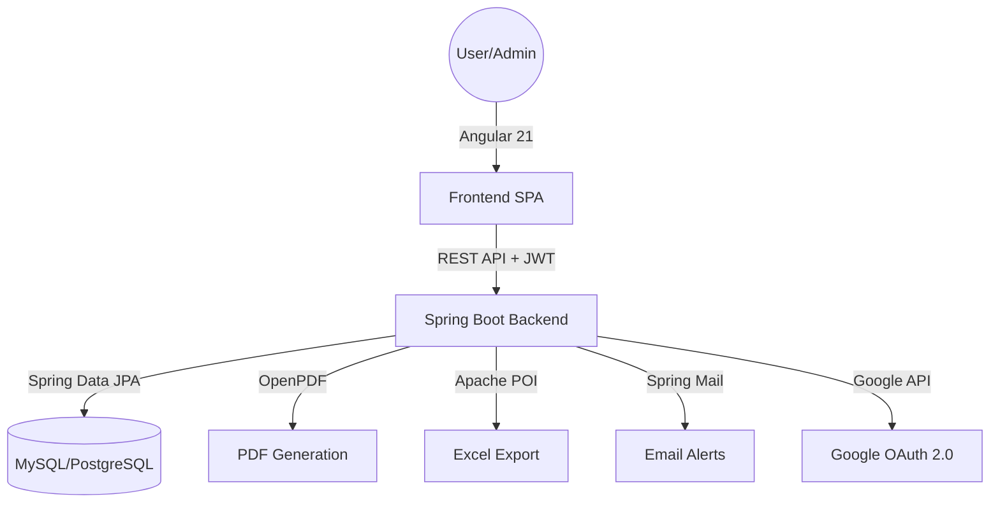

# 🎓 EduShield – Child Education Insurance Management System


**EduShield** is a full-stack enterprise insurance management platform specifically designed for **Child Education Policies**. It provides a secure, automated, and user-centric experience for policyholders, underwriters, and claims officers.

---

## 🌟 Core Features

### 👤 User & Policyholder
- **Multi-Step Policy Application**: Interactive workflow for selecting children, policies, and assessing risk.
- **Dynamic Risk Engine**: Parent profile analysis (Occupation, Income, Age) to estimate insurance viability.
- **Claim Portal**: Digital filing for Maturity, Death Benefit, and Partial Withdrawals with automated document requirement mapping.
- **Premium tracking**: View payment history and upcoming dues.
- **Google Authentication**: Seamless one-click sign-in.

### 💼 Admin & Staff (Underwriter/Claims Officer)
- **Advanced Underwriting**: Review applications, assess risk scores, and approve/reject with automated certificate generation.
- **Claims Processing**: Verify documents and settle claims with role-based segregation.
- **Staff Management**: Create and manage specialized accounts for Underwriters and Claims Officers.
- **Audit Engine**: Robust logging of all system actions for compliance.
- **Data Export**: Professional Excel exports for User records, Policies, and Audit Logs.

---

## 🚀 System Architecture



---

## 🛠️ Technical Stack

### **Backend (Progamming & Logic)**
- **Framework**: Spring Boot 3.2.2 (Java 17)
- **Security**: Spring Security with **Stateless JWT (jjwt 0.12.3)**
- **Persistence**: Hibernate/JPA with H2 (Dev) and SQL support.
- **Documentation**: Swagger/OpenAPI 3 with `springdoc-openapi-ui`.
- **Media**: **OpenPDF** (High-quality insurance certificates) and **Apache POI** (Excel forensics).
- **Communication**: Spring Boot Starter Mail (SMTP Integration).

### **Frontend (UI/UX)**
- **Framework**: Angular 21 (Standalone Architecture)
- **State Management**: **Angular Signals** for reactive, performant state.
- **Design**: **Tailwind CSS** with premium, glassmorphic UI components.
- **Interactions**: Reactive Forms with custom async validators.
- **Notifications**: Custom Signal-based Toast system.
- **Testing**: Jasmine & Karma (Extensive coverage for all core services).

---

## 📦 Project Setup

### **Backend Configuration**
1.  Navigate to `backend/education-copy-3`.
2.  Update `src/main/resources/application.properties`:
    ```properties
    spring.datasource.url=jdbc:mysql://localhost:3306/edushield
    spring.datasource.username=root
    spring.datasource.password=your_password
    # JWT Secret for security
    app.jwt.secret=your_64_character_secret_key
    ```
3.  Run the application:
    ```bash
    mvn spring-boot:run
    ```

### **Frontend Configuration**
1.  Navigate to `frontend/child-insurance-app`.
2.  Install dependencies:
    ```bash
    npm install
    ```
3.  Run development server:
    ```bash
    ng serve
    ```
4.  Open `http://localhost:4200` to view the application.

---

## 🧪 Testing & Quality Assurance

The project follows a test-driven approach to ensure insurance logic reliability.

- **Frontend Coverage**: 230+ Unit tests covering:
  - Auth Interceptors & Guards
  - Risk Calculation Services
  - Multi-step form state persistence
  - Admin/User Dashboard metrics aggregation
- **Command to run**: `ng test --watch=false --browsers=ChromeHeadless`

---

## 🛡️ Security Implementation
- **Role-Based Access Control (RBAC)**: Distinct permissions for `ADMIN`, `USER`, `UNDERWRITER`, and `CLAIMS_OFFICER`.
- **CORS Configuration**: Secure cross-origin resource sharing.
- **Password Protection**: Strong hashing via BCrypt.
- **Frontend Guards**: `AuthGuard` and `RoleGuard` to prevent unauthorized route access.

---

## 🤝 Project Authors
Developed as a Graduation Capstone Project for **EduShield Child Education Insurance Management**.

---
*This README was automatically generated by analyzing the system's actual code implementation and architectural patterns.*
